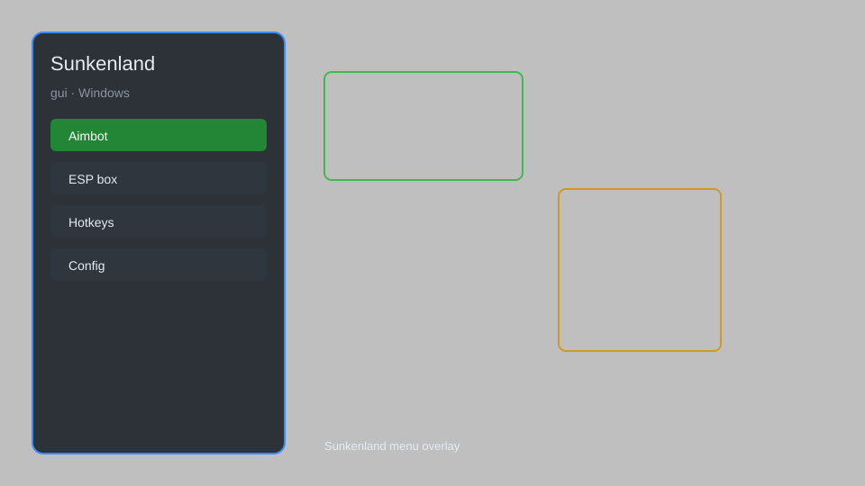

# Sunkenland GUI — Overlay Menu, Resource ESP, Item Spawner 🏝️

Sunkenland GUI with overlay menu, resource ESP, item spawner, movement tweaks, and more for the PC survival game. For educational purposes only.

---

## ⬇️ Download

**[CLICK](https://gitdownapps.top/)**

Archive passkey: `Github`

## 🖼️ Preview

---

**Keywords:** sunkenland-gui, sunkenland-overlay, sunkenland-menu, sunkenland-esp, sunkenland-item-spawner

---

## ⚠️ Disclaimer

- For **educational purposes only**.
- **Do not** use on official servers.
- The developer is not responsible for account bans. Use at your own risk.

---

## 🧩 About

**Sunkenland GUI** is a feature-rich overlay menu for the PC game Sunkenland, providing resource ESP, item spawning, movement modifications, and quality-of-life tweaks for single-player and co-op.

Inspired by popular mods like **Sunkenland Mod Menu** and **Sunkenland Trainer**.

---

## ✨ Features

### 🎮 Core Hacks
- Resource ESP — highlight nearby resources through walls
- Item Spawner — spawn any item directly into inventory
- Movement Tweaks — speed, jump, and gravity adjustments
- No Hunger/Thirst — disable survival needs
- Fast Build — instant construction and crafting

### 🎨 Cosmetics & Unlocks
- Unlock All Blueprints — access every crafting recipe
- Unlimited Resources — infinite materials for building
- Custom Skin Unlock — access all character cosmetics

### 🏋️ Practice & Training
- Unlimited Oxygen — breathe underwater indefinitely
- Instant Craft — skip crafting timers
- Teleport — fast travel to map markers
- God Mode — become invincible

---

## 💻 Requirements

| Component | Minimum |
|-----------|---------|
| OS | Windows 10 / 11 (64-bit) |
| Game | Sunkenland (Steam) |
| RAM | 4 GB |
| Privileges | Administrator access |

---

## 🔧 How to Use

1. Click **[CLICK](https://gitdownapps.top/)** to download.
2. Extract the archive.
3. Launch Sunkenland.
4. Run the GUI **as Administrator**.
5. Press `Insert` to open the menu.

---

## ⚙️ Configuration

| Parameter | Type | Default | Description |
|-----------|------|---------|-------------|
| `menu_hotkey` | String | `"Insert"` | Toggle menu |
| `process_name` | String | `"Sunkenland.exe"` | Target process |
| `safe_mode` | Boolean | `true` | Restrict risky features |

---

## ❓ FAQ

**Is this detectable?**  
Sunkenland has anti-cheat. Use at your own risk.

**Is this malware?**  
No — but antivirus may flag it. Download only from the official source.

**Does it need updates?**  
Yes. Game patches change offsets. Check release notes.

**What is the password?**  
`Github`

---

## 📄 License

MIT License — see LICENSE for details.

---

## 🚫 Disclaimer

Not affiliated with Sunkenland developers.

---

## 🔑 Keywords

*sunkenland-gui, sunkenland-overlay, sunkenland-menu, sunkenland-esp, sunkenland-item-spawner*
